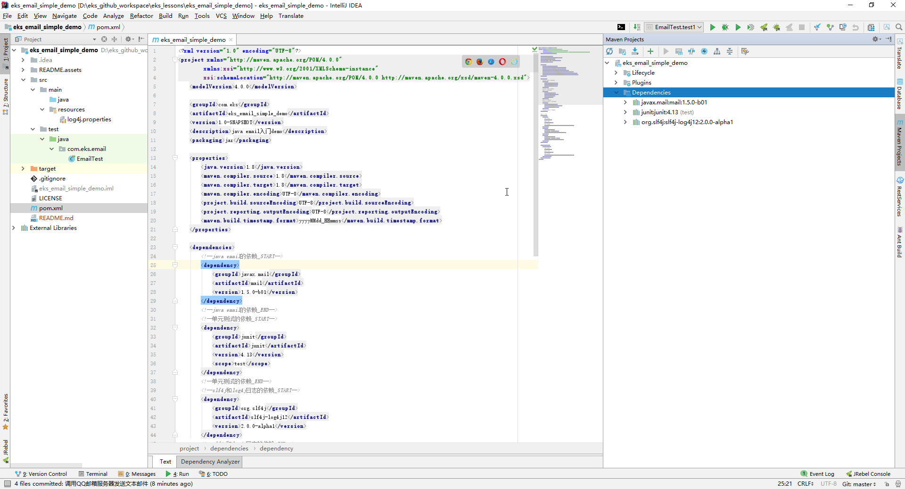
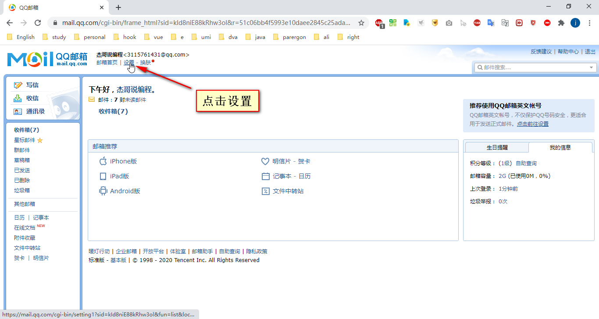
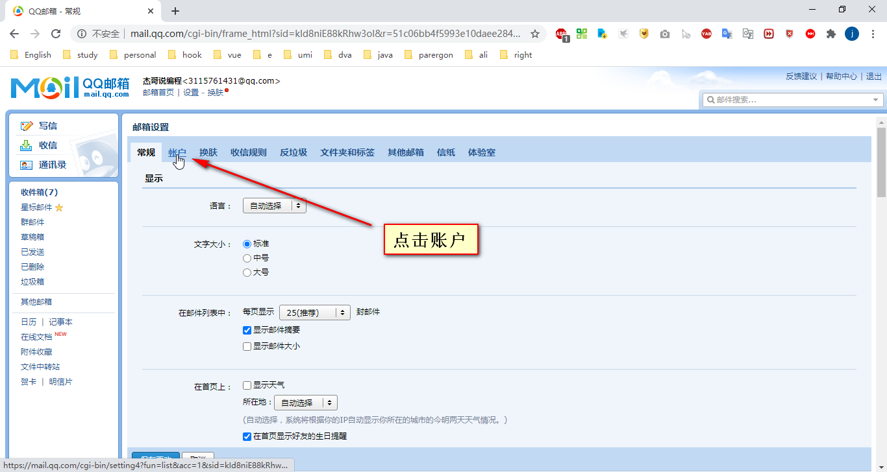
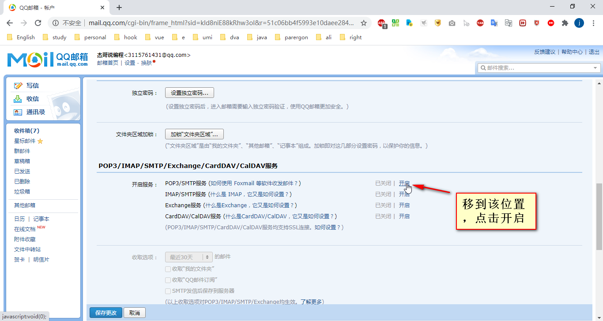
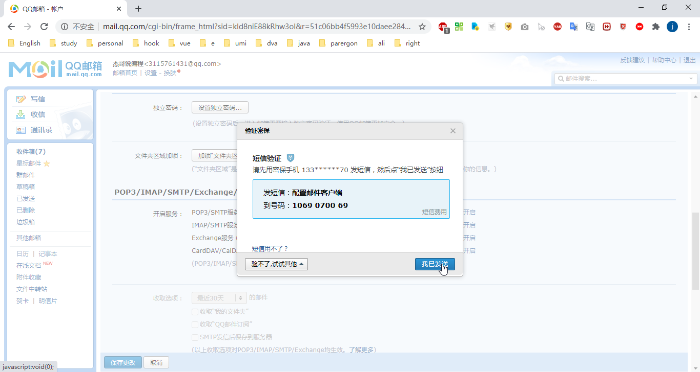
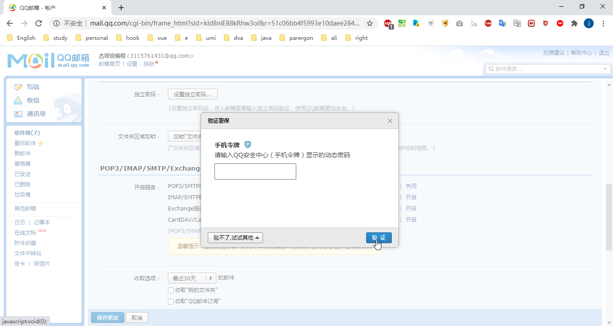
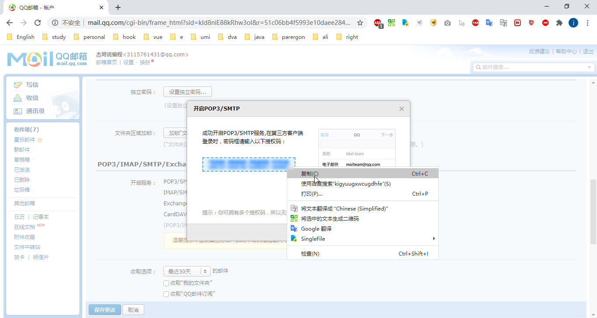
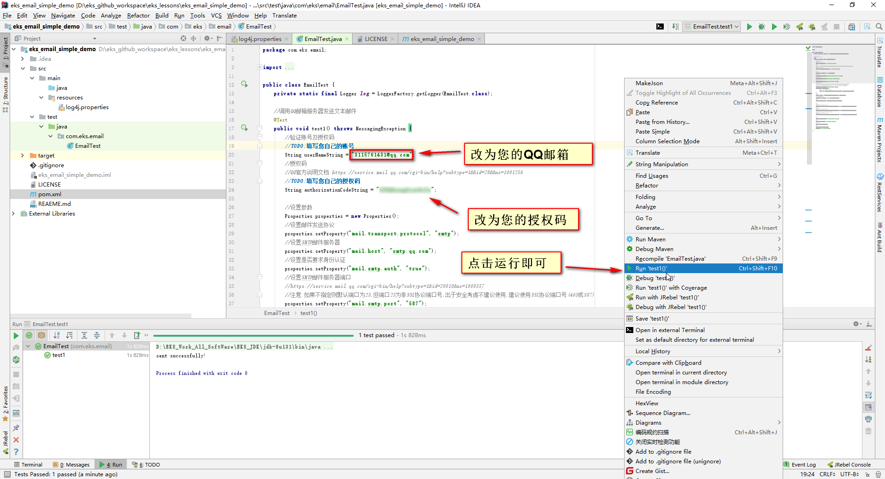
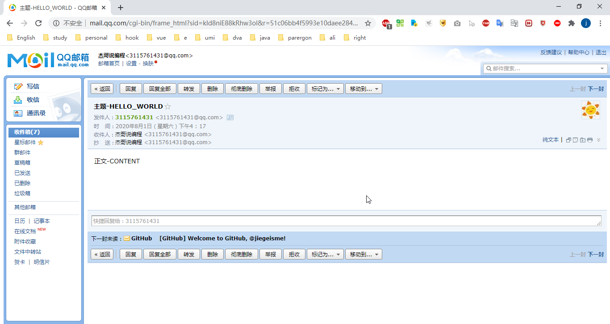

# java发送邮件入门

[TOC]

## 该项目能做什么？

> 使用java发送邮件，如QQ邮件等。

## 为什么要写该项目？

>目前网上的`博客`、`教程`等实操不易，主要存在以下问题：
>
>1.jar不全、pom文件没给、配置文件没给、省略了import等细节、代码不全等
>
>2.环境未告知、操作步骤没给或不详细、注释不够详细、运行效果截图没给等
>
>3.代码各种封装，不好消化，不够简洁有序，命名不规范，难以启动运行等

## 如何使用该项目？

### 1.`下载`或`git clone`本项目

> git clone https://github.com/jiegeisme/eks_email_simple_demo.git
>
> 或
>
> git clone git@github.com:jiegeisme/eks_email_simple_demo.git

### 2.使用`Eclipse`、`IDEA`等代码编辑器打开项目，引入pom依赖

### 3.按照下列图示生成`QQ邮箱授权码`

> 点击`设置`

> 点击`账户`

> 点击`开启`

> `短信验证`

> 或者可以使用`手机令牌`进行验证

> 下图打码部分即为`授权码`，建议立即复制保存到其他地方

### 4.在代码中填入您的`账号`、`QQ邮箱授权码`

>您还可以根据注释设置`收件人`、`主题`、`正文`

## 效果

## 联系方式

> QQ：3115761431

> WeChat：JIEGEISME

## 许可证

>GPL v3.0

## 欢迎star和打赏

 